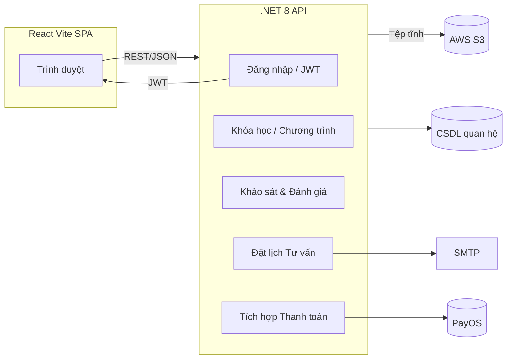

# Nền tảng Phòng chống Tệ nạn Ma túy

Một ứng dụng web toàn diện được phát triển cho tổ chức tình nguyện nhằm **phòng chống tệ nạn ma túy** trong cộng đồng. Nền tảng cung cấp tài nguyên giáo dục, khảo sát đánh giá rủi ro, đào tạo trực tuyến và dịch vụ tư vấn trực tiếp - tất cả trong một hệ thống thống nhất.

---

## 📖 Mục lục
1. [Tầm nhìn Dự án](#tầm-nhìn-dự-án)
2. [Tính năng Chính](#tính-năng-chính)
3. [Công nghệ Sử dụng](#công-nghệ-sử-dụng)
4. [Kiến trúc Tổng quan](#kiến-trúc-tổng-quan)
5. [Phát triển Cục bộ](#phát-triển-cục-bộ)
6. [Biến Môi trường](#biến-môi-trường)
7. [Triển khai](#triển-khai)
8. [Đóng góp](#đóng-góp)
9. [Giấy phép](#giấy-phép)
10. [Liên hệ](#liên-hệ)

---

## 🚀 Tầm nhìn Dự án

> "Trao quyền cho cộng đồng với kiến thức, công cụ đánh giá và hướng dẫn chuyên gia để **ngăn chặn lạm dụng ma túy trước khi nó bắt đầu**."

Nền tảng hỗ trợ các nhóm người dùng khác nhau - học sinh, phụ huynh, giáo viên, tình nguyện viên y tế - với nội dung được thiết kế riêng, đánh giá rủi ro tương tác (ASSIST, CRAFFT, ...), đặt lịch hẹn với tư vấn viên và bảng điều khiển tiến độ.

---

## 🧩 Tính năng Chính

| Mô-đun | Mô tả |
| ------ | ----- |
| Trang chủ / Blog | Trang đích công khai giới thiệu tổ chức và chia sẻ các bài viết thực hành tốt nhất & câu chuyện thành công. |
| Khóa học | Tìm kiếm, đăng ký và hoàn thành các khóa đào tạo trực tuyến (ví dụ: nâng cao nhận thức, kỹ năng từ chối). Nội dung được lọc theo độ tuổi. |
| Đánh giá Rủi ro | Khảo sát tương tác (ASSIST, CRAFFT, v.v.) để xác định mức độ rủi ro sử dụng ma túy. Đưa ra khuyến nghị cá nhân hóa khi hoàn thành. |
| Đặt lịch Tư vấn | Lịch thời gian thực & đặt lịch với tư vấn viên được chứng nhận. Nhắc nhở qua email & bảng điều khiển cho tư vấn viên. |
| Chương trình Cộng đồng | Quản lý các sự kiện truyền thông / giáo dục với **khảo sát trước/sau** để đo lường tác động. |
| Người dùng & Hồ sơ | Xác thực dựa trên JWT, vai trò (Quản trị, Tư vấn viên, Người dùng), quản lý hồ sơ, theo dõi lịch sử. |
| Bảng điều khiển Quản trị | KPI, phân tích khóa học, thông tin chương trình, thống kê cuộc hẹn, báo cáo có thể xuất. |

---

## 🛠️ Công nghệ Sử dụng

### Giao diện người dùng

* **React 19 + Vite** – máy chủ phát triển & gói nhanh như chớp.
* **TypeScript** – gõ tĩnh để giảm lỗi runtime.
* **PNPM** – trình quản lý gói hiệu suất cao với hỗ trợ workspace.
* **Ant Design 5** – thành phần UI hiện đại.
* **JWT** – xác thực không trạng thái & định tuyến dựa trên vai trò.
* **Axios + React-Query** – tìm nạp & lưu trữ dữ liệu.
* **Vercel** – triển khai xem trước & lưu trữ edge.
* **AWS S3** – lưu trữ đối tượng bền vững cho hình ảnh, video & tài liệu.

### Máy chủ

* **.NET 8 (C#)** – REST API hiệu suất cao.
* **Entity Framework Core** – lớp truy cập dữ liệu.
* **JWT Authentication** – token truy cập an toàn & luồng làm mới.
* **SendMail / SMTP** – email giao dịch (xác minh, nhắc nhở).
* **PayOS** – cổng thanh toán cho đào tạo có phí (nếu có).
* **Azure App Service / Render** – lưu trữ API tự động mở rộng.
* **Render** – lưu trữ API tự động mở rộng.
* **SQL Server** – cơ sở dữ liệu quan hệ.

### DevOps / Công cụ

* **GitHub Actions** – pipeline CI (lint, test, build, deploy).

---

## 🏗 Kiến trúc Tổng quan



---

## ⚙️ Phát triển Cục bộ

### Yêu cầu

* **Node >= 18** và PNPM
* **.NET 8 SDK**

### 1. Clone & cài đặt

```bash
# HTTPS
git clone https://github.com/server-craftsman/swp391-web-app-drug-use-prevention-support-system
cd swp391-web-app-drug-use-prevention-support-system

# Cài đặt frontend
pnpm install
```

### 2. Chạy Frontend

```bash
pnpm run dev
# Ứng dụng tại http://localhost:3000
```

---

## 🚀 Triển khai

| Môi trường | Công nghệ | Nhánh |
| ---------- | --------- | ----- |
| **Vercel** | Static/Serverless (Frontend) | `main` |
| **Azure App Service** | .NET API | `main` |
| **Render** | .NET API | `main` |

CI/CD được tự động hóa bởi **GitHub Actions**. Mỗi lần push vào `main` sẽ tự động build & deploy.

---

## 🤝 Đóng góp

1. Fork repository và tạo branch `feat/<tên>`.
2. Commit theo chuẩn **Conventional Commits**.
3. Mở Pull Request, điền mẫu PR và liên kết issue liên quan.
4. Đảm bảo pipeline CI xanh trước khi request review.

Xem thêm trong `CONTRIBUTING.md` để biết chi tiết.

---

## 📜 Giấy phép

Dự án phát hành theo giấy phép **MIT**. Xem file `LICENSE` để biết thêm chi tiết.

---

## 📬 Liên hệ

* **Nguyễn Đan Huy** – huyit2003@gmail.com
* Vui lòng tạo **GitHub Issue** cho lỗi hoặc yêu cầu tính năng.

> “Chung tay xây dựng tương lai không ma túy.” 🌱
